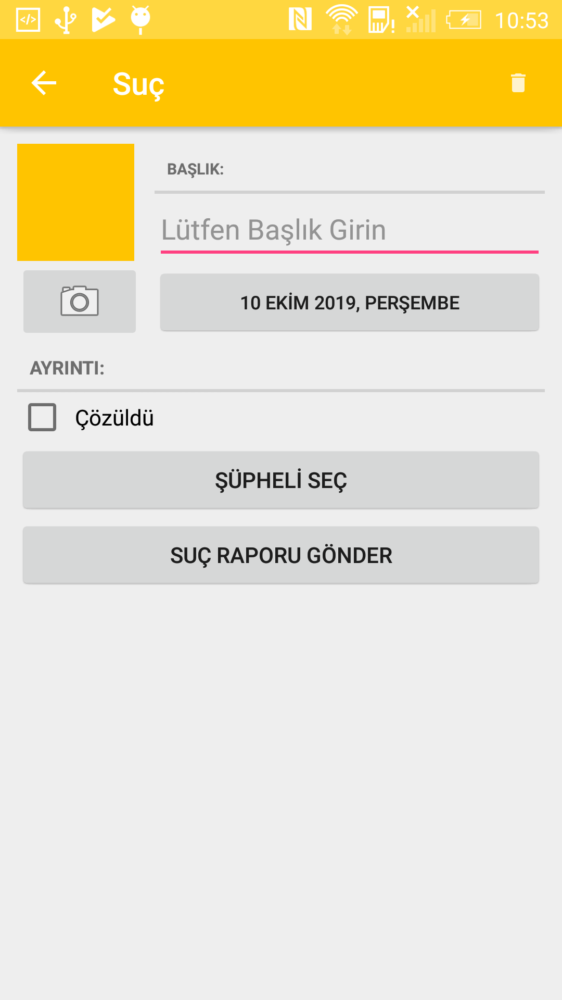
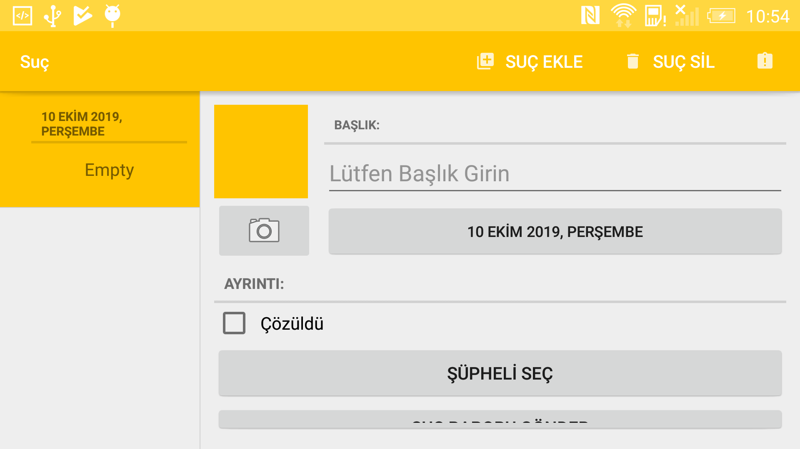

# Crime Apps
	That app is created from the big nerd ranch guide book

## Information

	This app includes a lot of examples or practice
	* android database
	* intents and bundle
	* interfaces
	* xml layout
	* menus
	* saved instance for rotation
	* callbacks
	* recycleview
	* slide delete

## Known İssue

	* app crash when added photos button clicked!
	* layout problem while adding a new crime on rotation

## Features to add
	* splash screen
	* firebase data sharing
	* location crime on maps
	* marks a crime location on the map
	
## Snapshots
 
 

## Contributing
* if you want to join in the project, don't hesitate ! :) 

## Acknowledgments
* The big nerd ranch guide books 
* [Book Web Site](https://www.bignerdranch.com/books/android-programming-the-big-nerd-ranch-guide/)
